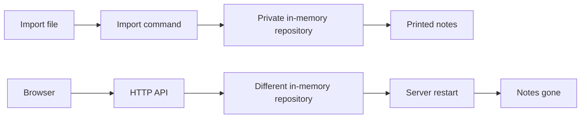

# Field Notes Repair: Jen's Study Guide

> **Current checkpoint:** This is the canonical summary of the five-agent repair
> as verified on 2026-09-12. The full project check passes 89 tests. The longer
> topic chapters in this folder preserve the investigation as it unfolded, so
> some of their earlier "current state" language is intentionally historical.

## Start here

We repaired Field Notes by tracing backward from the result a user could see:

> If the tool says it imported notes, where did those notes actually go, and
> will they still be there after the server stops?

At the beginning, several pieces worked by themselves, but the complete route
did not. The import command could print notes that never reached the running
application. The server could hold notes in memory, but a restart erased them.
The importer could validate a whole file, but it saved records one at a time, so
a later storage failure could leave half an import behind.

The repaired route is now:

```text
JSON file
  -> real import command
  -> one POST /api/import request
  -> complete-payload validation
  -> one service operation
  -> one repository add_many operation
  -> one SQLite transaction
  -> committed database rows
  -> new server process
  -> same notes returned through the public API
```

That full path has success and failure tests. A controlled failure on the second
row rolls the complete batch back. After the failure is removed, a clean retry
uses the expected IDs, and the results survive a complete process restart.

## Why we worked backward

The architecture diagrams originally had grey nodes that appeared to work even
though nearby red nodes were broken. That looked strange until we separated two
kinds of proof:

- **Component proof:** a class or function works when a test calls it directly.
- **Connection proof:** the real user entry point reaches that component through
  every layer of the running application.

A SQLite repository can pass its own tests while the server still constructs an
in-memory repository. A CLI can print imported records while writing only to a
private object that disappears when the command exits. The grey nodes were not
lying; they were simply proving a smaller claim than the product needed.

Working backward kept the question concrete:

```text
observable result
  <- public API response
  <- running service
  <- selected repository
  <- committed database state
```

Then we followed the same route forward and repaired the first missing arrow.

## Before and after

### Before



The command and server each had their own state. Printed success did not prove
application persistence.

### After

```mermaid
flowchart LR
    File["Import file"] --> CLI["Import command"]
    CLI -->|"one request"| Route["POST /api/import"]
    Route --> Validate["Validate complete payload"]
    Validate --> Service["NoteService.import_notes"]
    Service --> Batch["repository.add_many"]
    Batch -->|"one transaction"| SQLite[("SQLite database")]
    SQLite --> Restart["new server process"]
    Restart --> Visible["same notes through GET /api/notes"]
```



The browser and import command now share one runtime authority and one durable
state owner.

## What each agent owned

### Agent 1: Architecture and integration lead

**Question:** Which connection should be fixed next, and what evidence is strong
enough to turn it green?

Agent 1 kept the shared contract stable, reviewed incoming work against the live
tree, reran forward and backward traces, and separated completed repairs from
remaining holds. This prevented a component test from being mistaken for an
end-to-end result.

**Main lesson:** integration is its own engineering job. Someone has to decide
which implementation is authoritative, reconcile concurrent work, and make the
architecture match observed behavior.

### Agent 2: Durable storage

**Question:** Can the same repository behavior be backed by SQLite without
silently damaging or claiming an existing database?

Agent 2 added `SQLiteNoteRepository` with:

- create, list, delete, clear, and `add_many` behavior;
- explicit transactions and rollback;
- close/reopen persistence;
- locking for concurrent callers sharing the repository;
- schema version 1;
- careful handling of version-zero databases;
- visible failure for corrupt, incompatible, or unknown schemas; and
- parity tests shared with the in-memory adapter.

The subtle part was `PRAGMA user_version = 0`. It can mean a fresh database, but
it can also mean an existing unversioned database. The adapter inspects the
schema and rows before adopting it instead of assuming it is empty.

**Main lesson:** durable storage is more than writing a file. It includes schema
ownership, migration safety, transaction boundaries, lifecycle, and proof that
committed records survive reopening.

### Agent 3: Atomic import

**Question:** Can one input file become one all-or-nothing storage operation?

Agent 3 introduced a storage-neutral `NoteDraft`, complete-payload validation,
`NoteService.import_notes`, `POST /api/import`, and `add_many` in both repository
adapters.

The importer validates every item before storage begins. The SQLite adapter then
holds one lock and one `BEGIN IMMEDIATE` transaction across the full batch. If
row two fails after row one was inserted, rollback removes row one too.

**Main lesson:** validating the whole batch prevents predictable input errors
from causing partial writes; a database transaction protects against failures
that happen after writing has started. We need both.

### Agent 4: Runtime composition and command wiring

**Question:** Does the running server select the durable repository, and does the
real command use the accepted batch boundary?

Agent 4 added the composition root that creates one configured SQLite repository,
injects it into `NoteService`, and gives the server ownership of closing it. The
import command was then changed from repeated `POST /api/notes` calls to exactly
one `POST /api/import` request containing the original parsed payload.

Keeping semantic validation on the server matters. The CLI reads JSON so it can
report a useful file error, but it does not normalize fields or invent missing
timestamps before sending the document. There is one authority for import rules.

**Main lesson:** dependency injection here is practical, not decorative. It
makes the state owner explicit and stops different entry points from quietly
constructing different repositories.

### Agent 5: Independent connection verification

**Question:** Does the full public path work across real process boundaries?

Agent 5 added subprocess tests that launch the actual server, run the actual CLI,
communicate through HTTP, stop the process, and start a new one against the same
database.

The tests prove:

- imported notes are visible through the public list API;
- IDs, fields, normalized tags, and timestamps survive restart;
- create and delete both persist across separate server processes;
- an empty import is an ID-neutral no-op;
- invalid data later in a payload causes zero mutation;
- a controlled second-row SQLite failure rolls back the complete batch;
- retry after acknowledged rollback is clean; and
- corrupt or incompatible configured databases stop startup without a memory
  fallback.

**Main lesson:** independent black-box verification tests the arrows, not just
the boxes.

## The evidence ladder

Each level proves more than the one before it:

1. **Unit test:** one function or class behaves correctly.
2. **Contract test:** memory and SQLite adapters obey the same repository rules.
3. **Integration test:** route, service, and repository work together.
4. **Process test:** a real server process receives real HTTP traffic.
5. **Restart test:** a new process sees the same committed state.
6. **Failure-path test:** a controlled failure stops at the promised boundary
   and leaves the prior state unchanged.

The current 89-test check includes all six levels for the repaired import path.
That count is useful context, but the important evidence is what those tests
cross and what they assert.

## Current status

### Green: repaired and verified

- Configured SQLite is the running server's state owner.
- HTTP create and delete survive complete server restarts.
- The import command sends one complete request to `/api/import`.
- Import validation covers the complete payload before storage starts.
- Both repositories implement one `add_many` operation.
- SQLite commits a batch in one transaction and rolls it back on failure.
- Imported IDs are local; supplied source IDs are ignored.
- Timezone-aware source timestamps preserve their instant in canonical UTC.
- Empty import succeeds without consuming an ID.
- Corrupt and incompatible stores fail visibly without falling back to memory.

### Green: the final three acceptance holds

- **R1, startup ordering:** `build_server()` now parses `FIELDNOTES_PORT` before
  opening SQLite. A permanent test proves a malformed port creates no database.
- **I1, error classification:** import validation now raises the dedicated
  `ImportValidationError`. The route maps that client error to `400`, while a
  repository `ValueError` escapes to the server's `500` boundary.
- **I2, concurrency regression coverage:** the shared memory/SQLite conformance
  suite now races a 40-note batch against one single add and proves the batch IDs
  remain contiguous.

Those issues were found during integration review, fixed by the owning lanes,
and accepted in the 89-test live tree.

### Red: intentionally not built yet

- Atomic export.
- Export-to-import recovery proof.
- A defined overwrite/conflict policy for export destinations.

Retry idempotency is also outside the current contract. If the server commits a
batch but the HTTP response is lost, a blind retry may duplicate it. Transaction
atomicity protects one attempt; an idempotency key would protect ambiguous
retries. Those are related, but they are not the same feature.

## Key terms in plain language

- **Repository:** the interface the service uses to store and retrieve notes.
- **Adapter:** one implementation of that interface, such as memory or SQLite.
- **State owner:** the repository instance that holds the authoritative data for
  the running application.
- **Composition root:** the startup location that constructs concrete
  dependencies and connects them together.
- **Dependency injection:** giving the service its repository instead of letting
  the service secretly create one.
- **Transaction:** a database unit that either commits all included changes or
  rolls them all back.
- **Atomicity:** the batch appears completely or not at all.
- **Durability:** committed data survives closing and reopening the application.
- **Rollback:** undoing every write in a failed transaction.
- **Schema version:** a recorded contract for the database structure.
- **Black-box test:** a test that uses public entry points without reaching into
  internal objects to force the answer.
- **Idempotency:** retrying the same operation does not create a second effect.
  The current import is atomic but not idempotent.

## A concise interview version

> I coordinated a five-agent repair of a deliberately messy notes application.
> We traced backward from the user-visible result and found that several parts
> worked in isolation but were not connected: the CLI wrote to private memory,
> the server lost state on restart, and a file import could partially commit.
>
> I split the repair into durable storage, atomic import, runtime composition,
> independent connection verification, and integration ownership. We added a
> guarded SQLite adapter, made the server use one configured state owner, moved
> import to one validated batch and one transaction, and then proved the full
> CLI-to-HTTP-to-SQLite route across process restarts. We also tested a forced
> second-row failure to show the batch rolled back cleanly.
>
> The main thing I learned was to distinguish a component that works from a
> connection that works. The final suite has 89 tests, but the stronger claim is
> that the tests cross the real process and failure boundaries we care about.

## Technical follow-ups you should be ready for

**Why SQLite?**

It fits a local notes application: one portable file, transactions, mature
failure behavior, and no separate database server. The repository boundary also
keeps the service from depending directly on SQLite.

**Why use one batch request instead of repeated create requests?**

Repeated requests make each note a separate unit of work. If request three
fails, requests one and two have already committed. One request lets the server
validate and transact the file as one operation.

**Why validate before opening the transaction?**

It rejects predictable payload errors before any write attempt. The transaction
still protects us from storage failures after writing begins.

**What does `BEGIN IMMEDIATE` do here?**

It reserves SQLite's write path at the start of the mutation, so another writer
cannot slip into the middle of the batch through the same database while that
transaction is active.

**Does atomic mean retries are safe?**

No. Atomic means one attempt is all-or-nothing. If the commit succeeds and only
the response is lost, a retry can duplicate the batch. Safe ambiguous retries
would need an idempotency key or equivalent request identity.

**What was the hardest edge case?**

Treating SQLite schema version zero carefully. Zero can describe a fresh file or
an existing unversioned database. We inspect schema compatibility and row
readability before adopting it, and reject unsafe cases without mutation.

**How did the agents avoid stepping on each other?**

Each lane owned a connection and its focused files. Shared contracts stopped for
integration acceptance, Agent 1 maintained the canonical ledger, and the team
reran the live suite and architecture traces after connections landed.

## Reading order

1. Read this guide once for the complete story.
2. Read
   [`what-the-exercise-tested.md`](what-the-exercise-tested.md) for the hidden
   challenge design, the intended traps, and how the repair went beyond the
   original answer key.
3. Practice with [`interview-language.md`](interview-language.md) for short
   answers, technical follow-ups, accurate ownership language, and claims to
   verify before using them.
4. Open [`../shared/ARCHITECTURE_MAPS.md`](../shared/ARCHITECTURE_MAPS.md) and
   follow the current forward and backward traces.
5. Read [`durable-storage.md`](durable-storage.md) for schema, transactions, and
   repository design.
6. Read [`atomic-import.md`](atomic-import.md) for validation, batching, and the
   atomicity-versus-idempotency distinction.
7. Read
   [`runtime-composition-and-portability.md`](runtime-composition-and-portability.md)
   for state ownership, configuration, lifecycle, and command wiring.
8. Read [`connection-verification.md`](connection-verification.md) for the
   evidence ladder and subprocess test strategy.

## Source notes

The polished guide is not a replacement for the detailed record. Use these when
you want the exact investigation history or test evidence:

- [`../shared/SHARED_NOTES.md`](../shared/SHARED_NOTES.md): accepted integration
  ledger, resolved-hold history, and open decisions.
- [`../agent-1-integration-lead/NOTES.md`](../agent-1-integration-lead/NOTES.md):
  integration decisions and trace ownership.
- [`../agent-2-durable-storage/NOTES.md`](../agent-2-durable-storage/NOTES.md):
  SQLite and repository evidence.
- [`../agent-3-atomic-import/NOTES.md`](../agent-3-atomic-import/NOTES.md): batch
  contract and rollback evidence.
- [`../agent-4-runtime-composition/NOTES.md`](../agent-4-runtime-composition/NOTES.md):
  runtime wiring and CLI migration.
- [`../agent-5-connection-verification/NOTES.md`](../agent-5-connection-verification/NOTES.md):
  public process, restart, and controlled-failure evidence.

For a future study packet, this README should become the main chapter. The
exercise retrospective and interview guide can follow it, the four topic guides
can become deeper appendices, and the raw agent notes can remain a
source-evidence section rather than being copied into the main narrative.
