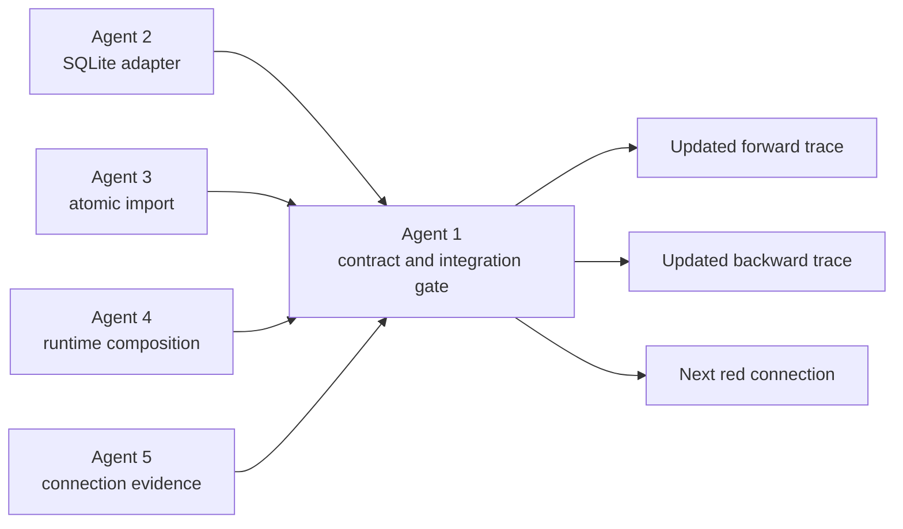

# Agent 1 Architecture

## Owned View

## Integration Boundaries

- Repository contract between service/import and storage.
- Composition boundary between configuration and server repository selection.
- Transaction boundary between validated import data and committed notes.
- Evidence boundary between component tests and cross-process behavior.

Agent 1 integrates these boundaries but does not redesign unrelated amber behavior during the storage pass.

