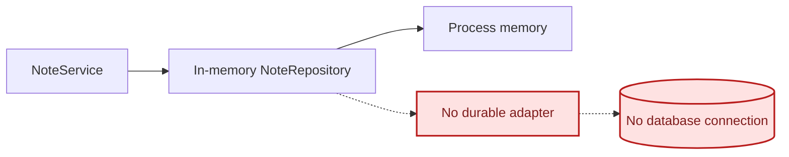
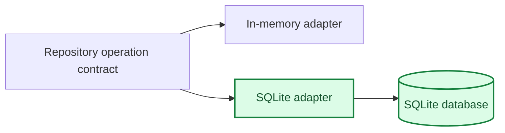

# Agent 2 Architecture

## Current Connection

## Agent 2 Target

The new adapter remains disconnected from `server.py` during this assignment. Agent 1 and Agent 4 handle runtime selection after reopen evidence passes.

