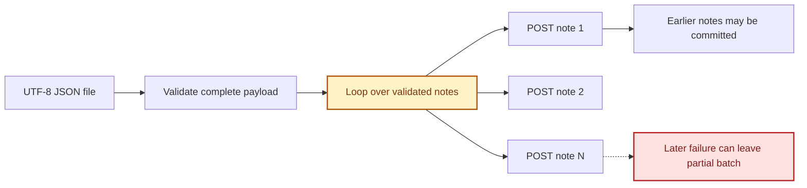
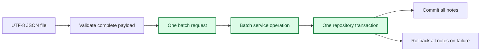

# Agent 3 Architecture

## Current Import Path

## Agent 3 Target

The repository transaction implementation belongs to Agent 2. Agent 3 owns the application-level meaning of a batch and the API/service connection into that transaction.

