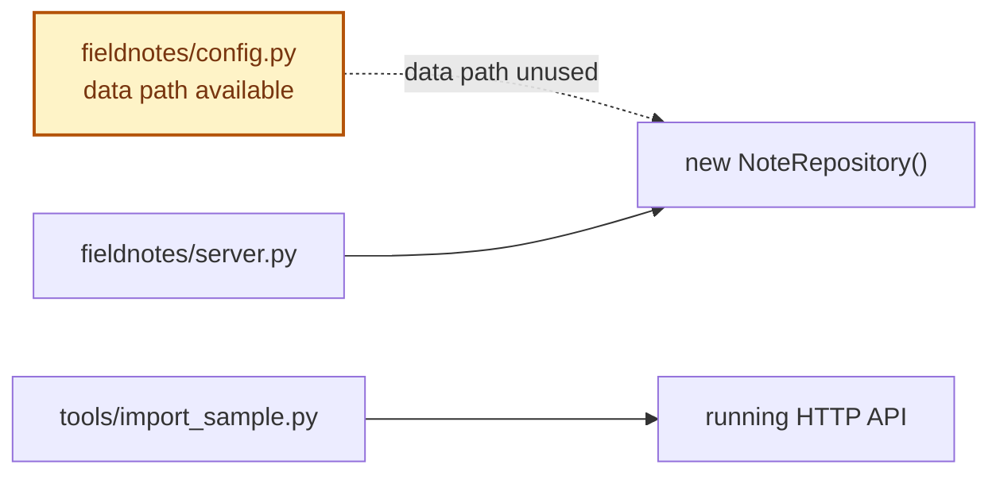
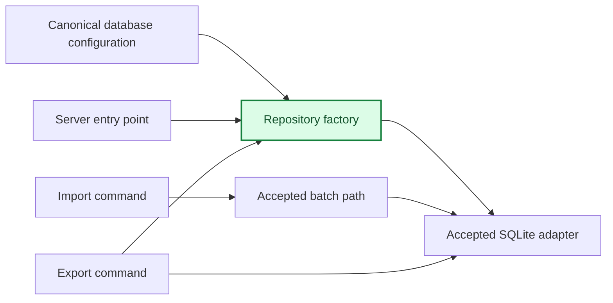

# Agent 4 Architecture

## Current Composition

## Agent 4 Target

The first active connection is server to configured SQLite. Import and export connections activate only after their preceding gates pass.

