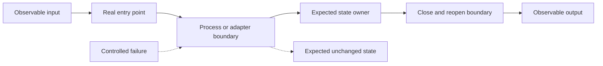
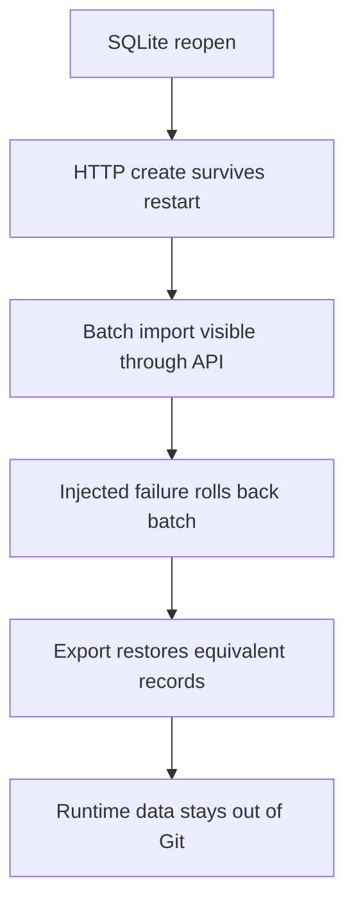

# Agent 5 Architecture

## Evidence Path

Agent 5 tests connections rather than substituting direct calls for them. For example, server persistence evidence must cross a real server-process restart, not merely construct the same repository twice in one test process.

## Verification Targets

