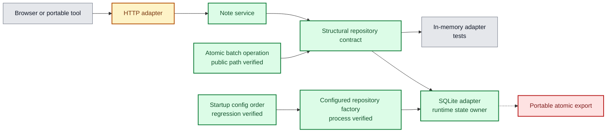
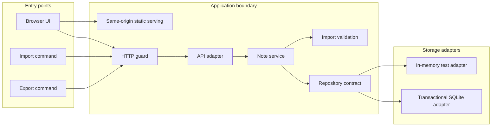
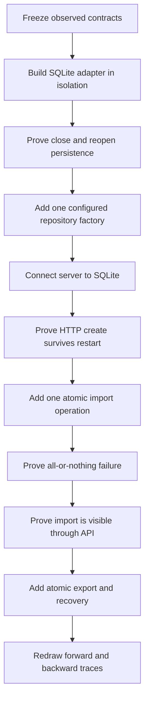

# Shared Architecture Maps

These diagrams are working maps, not promises. Update them from verified runtime evidence after every accepted connection change.

## Legend

- Green: repaired and verified.
- Grey: works for its current responsibility.
- Amber: carries traffic but has a known defect or incomplete responsibility.
- Red: missing component or missing connection required by intended behavior.

## 1. Architecture Overview

```mermaid
flowchart LR
    Browser["Browser UI<br/>web/index.html + app.js"]:::working
    Client["HTTP client<br/>web/api.js"]:::degraded
    Static["Separate static server<br/>port 8080"]:::degraded
    HTTP["ThreadingHTTPServer<br/>working HTTP boundary"]:::working
    API["Route adapter<br/>fieldnotes/api.py"]:::working
    Service["Business rules<br/>fieldnotes/service.py"]:::working
    Memory["In-memory repository<br/>test adapter"]:::working
    SQLite["SQLite repository<br/>schema and reopen verified"]:::fixed
    Database[("Configured SQLite database<br/>restart verified by Agents 1 and 5")]:::fixed
    RuntimeLink["Configured repository composition<br/>process verified"]:::fixed
    Startup["Startup config ordering<br/>port parsed before storage"]:::fixed

    ImportTool["Import command<br/>one complete request"]:::fixed
    BatchRoute["POST /api/import<br/>error classes separated"]:::fixed
    BatchService["Service batch operation"]:::fixed
    Importer["Typed complete-payload validation"]:::fixed
    AddMany["Repository add_many<br/>atomic rollback verified"]:::fixed
    Export["Atomic export and recovery<br/>not implemented"]:::missing

    Browser --> Client
    Static --> Browser
    Client --> HTTP
    HTTP --> API
    API --> Service
    Service --> RuntimeLink
    Startup --> RuntimeLink
    Service -.->|"unit tests"| Memory
    RuntimeLink --> SQLite
    SQLite --> Database

    ImportTool -->|"one POST /api/import"| HTTP
    HTTP --> BatchRoute
    BatchRoute --> BatchService --> Importer --> AddMany --> SQLite
    Database -.-> Export

    classDef working fill:#e5e7eb,stroke:#6b7280,color:#111827
    classDef fixed fill:#dcfce7,stroke:#15803d,color:#14532d,stroke-width:2px
    classDef degraded fill:#fef3c7,stroke:#b45309,color:#78350f,stroke-width:2px
    classDef missing fill:#fee2e2,stroke:#b91c1c,color:#7f1d1d,stroke-width:2px
```

## 2. Current Forward Trace

Start with configuration and the two public entry paths, then follow each active
connection toward the authoritative state owner.

```mermaid
flowchart LR
    DataEnv["Data configuration<br/>FIELDNOTES_DATA"]:::working
    PortEnv["Port configuration<br/>FIELDNOTES_PORT"]:::working
    Port["Port parsing<br/>before storage"]:::fixed
    Build["Server construction<br/>build_server"]:::working
    Factory["Composition root<br/>create_service"]:::fixed
    HTTP["Injected HTTP server"]:::working
    API["Route adapter"]:::working
    Service["NoteService"]:::working
    SQLite["SQLiteNoteRepository"]:::fixed
    Disk[("Configured SQLite file")]:::fixed
    Memory["In-memory repository<br/>tests only"]:::working

    Browser["Browser UI"]:::degraded
    Client["web/api.js"]:::degraded
    File["Import JSON file"]:::working
    Tool["Import command<br/>one-request connection verified"]:::fixed
    BatchRoute["POST /api/import"]:::fixed
    BatchService["Service batch operation"]:::fixed
    Validator["Typed complete-payload validation"]:::fixed
    AddMany["Repository add_many<br/>rollback verified"]:::fixed
    Export["Atomic export and recovery"]:::missing

    DataEnv --> Build
    PortEnv --> Build
    Build -->|"1. parse port"| Port
    Port -->|"2. open storage"| Factory
    Factory --> Service
    Factory --> SQLite
    Factory --> HTTP
    Service --> HTTP
    HTTP --> API --> Service --> SQLite --> Disk
    Service -.->|"unit tests"| Memory

    Browser --> Client --> HTTP
    File --> Tool
    Tool -->|"one POST /api/import"| HTTP
    HTTP --> BatchRoute
    BatchRoute --> BatchService
    BatchService --> Validator
    Validator --> AddMany
    AddMany --> SQLite
    Disk -.-> Export

    classDef working fill:#e5e7eb,stroke:#6b7280,color:#111827
    classDef fixed fill:#dcfce7,stroke:#15803d,color:#14532d,stroke-width:2px
    classDef degraded fill:#fef3c7,stroke:#b45309,color:#78350f,stroke-width:2px
    classDef missing fill:#fee2e2,stroke:#b91c1c,color:#7f1d1d,stroke-width:2px
```

## 3. Current Backward Trace

Start at observable outcomes on the right and trace back toward the state owner on the left.

```mermaid
flowchart RL
    BrowserOutcome["Notes visible in browser"]:::working
    ImportOutcome["Printed imported notes<br/>and restart-visible notes"]:::fixed
    FailureOutcome["Failed batch leaves prior state unchanged"]:::fixed

    UI["web/app.js"]:::degraded
    Client["web/api.js"]:::degraded
    Tool["tools/import_sample.py<br/>one batch request"]:::fixed
    Validator["complete-payload validation"]:::fixed
    HTTP["fieldnotes/server.py<br/>configured SQLite runtime"]:::fixed
    API["fieldnotes/api.py"]:::working
    BatchRoute["POST /api/import"]:::fixed
    Service["fieldnotes/service.py"]:::working
    Runtime["composition.create_service<br/>process verified"]:::fixed
    Startup["port parsed before repository construction"]:::fixed
    AddMany["repository.add_many<br/>one transaction"]:::fixed
    SQLite["SQLiteNoteRepository"]:::fixed
    Disk[("configured SQLite file<br/>create and delete survive restart")]:::fixed
    Memory["in-memory NoteRepository<br/>tests only"]:::working
    Export["portable atomic export<br/>not implemented"]:::missing

    BrowserOutcome --> UI
    UI --> Client
    Client --> HTTP

    ImportOutcome --> Tool
    Tool --> HTTP
    FailureOutcome --> AddMany

    HTTP --> API
    API --> Service
    HTTP --> BatchRoute
    BatchRoute --> Service
    Service --> Validator
    Validator --> AddMany
    AddMany --> SQLite
    Service --> Runtime
    Runtime --> Startup
    Runtime --> SQLite
    SQLite --> Disk
    Service -.->|"unit tests"| Memory
    Export -.-> Disk

    classDef working fill:#e5e7eb,stroke:#6b7280,color:#111827
    classDef fixed fill:#dcfce7,stroke:#15803d,color:#14532d,stroke-width:2px
    classDef degraded fill:#fef3c7,stroke:#b45309,color:#78350f,stroke-width:2px
    classDef missing fill:#fee2e2,stroke:#b91c1c,color:#7f1d1d,stroke-width:2px
```

All observable note paths now trace to the same SQLite state owner. The real
command sends one complete request, and the public path has transaction rollback,
clean retry, and process-restart proof. Portable atomic export and recovery are
the next red connection.

## 4. Current Repair Architecture

This map shows the accepted application boundary after durable runtime and
atomic import became active.

## 5. Ideal Architecture

## 6. Optimal Connection Flow

Everything through `Visibility` is implemented and verified. `Export` is the
next red connection; redraw follows its acceptance evidence.

## Trace Update Standard

After every accepted connection:

1. Change only nodes and arrows supported by direct evidence.
2. Keep working-but-imperfect components amber rather than red.
3. Reserve red for genuinely absent or disconnected behavior.
4. Record the exact command or test proving the new arrow.
5. Record the failure test proving where that arrow stops.
6. If a new hidden dependency appears, add it before choosing the next repair.
