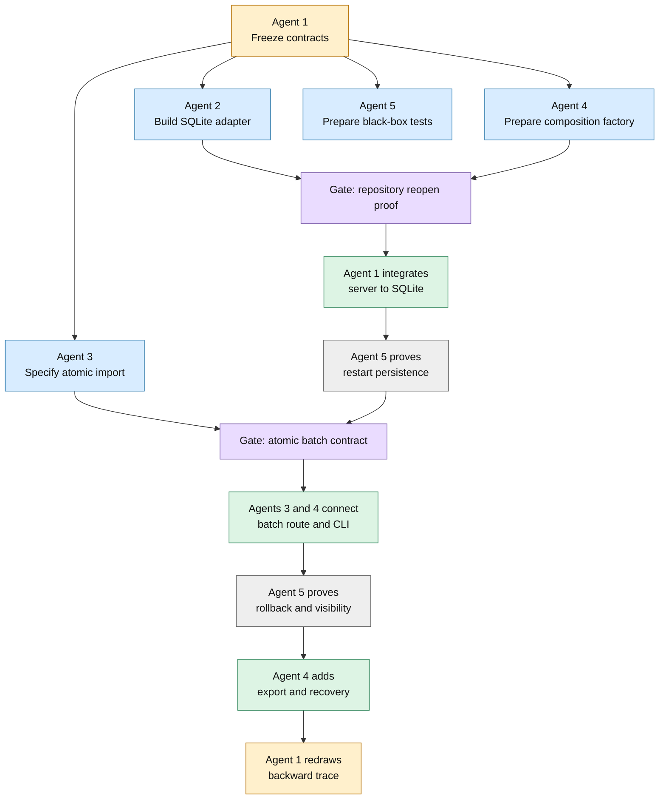

# Connection-First Repair Plan

Status: Draft for the five-agent repair exercise  
Scope: Fix missing storage and data-path connections before polishing degraded but working components.

## Decision

Work backward from observable outcomes. Preserve components that currently carry traffic, even when they are imperfect. Fix genuinely missing connections first, run an acceptance test after each connection, and redraw the trace before choosing the next repair.

The upper browser path remains out of scope until the lower storage path is connected and observable.

## Legend

- Green: repaired and verified connection.
- Grey: works for its current responsibility.
- Amber: carries traffic but has a known defect or incomplete responsibility.
- Red: missing component or connection required by the intended behavior.

## Current Backward Trace

```mermaid
flowchart RL
    Printed["Printed imported note"]:::working
    Tool["tools/import_sample.py<br/>Writes through the running API"]:::fixed
    Importer["fieldnotes/importer.py<br/>Works, but import is not atomic"]:::degraded
    HTTP["fieldnotes/server.py<br/>Working HTTP boundary"]:::degraded
    API["fieldnotes/api.py<br/>Working route adapter"]:::working
    Service["fieldnotes/service.py<br/>Working business rules"]:::degraded
    Repo["fieldnotes/repository.py<br/>Working in-memory repository"]:::degraded
    Memory["Process memory<br/>Correct for current role"]:::working

    Batch["Atomic batch operation<br/>Missing"]:::missing
    Durable["Durable repository adapter<br/>Missing"]:::missing
    Disk[("SQLite database<br/>Missing connection")]:::missing

    Printed --> Tool
    Tool --> Importer
    Tool --> HTTP
    HTTP --> API
    API --> Service
    Service --> Repo
    Repo --> Memory

    Importer -.->|"no atomic path"| Batch
    Batch -.->|"no transaction contract"| Durable
    Repo -.->|"no durable adapter selected"| Durable
    Durable -.->|"not implemented"| Disk

    classDef working fill:#e5e7eb,stroke:#6b7280,color:#111827
    classDef fixed fill:#dcfce7,stroke:#15803d,color:#14532d,stroke-width:2px
    classDef degraded fill:#fef3c7,stroke:#b45309,color:#78350f,stroke-width:2px
    classDef missing fill:#fee2e2,stroke:#b91c1c,color:#7f1d1d,stroke-width:2px
```

## Repair Order

### Gate 0: Freeze the observed contracts

Before implementation, record the current repository method signatures, note shape, import format, configuration names, and current passing tests. Do not fix amber behavior at this gate.

Exit evidence:

- Existing 34-test suite remains green.
- The import command reaches the running API.
- Restarting the server still demonstrates the expected current data loss.

### Connection 1: Implement durable storage in isolation

Add a SQLite repository adapter with the same working operations as the in-memory repository: list, add, delete, and clear. Do not connect it to the server yet.

Required behavior:

- Creates the database safely when absent.
- Commits successful creates and deletes.
- Preserves IDs and timestamps across repository reopen.
- Rolls back failed writes.
- Uses a configurable local path that is excluded from Git.
- Leaves the in-memory repository available for narrow unit tests.

Exit evidence:

- Repository conformance tests pass against memory and SQLite adapters.
- Reopening SQLite returns the same notes and IDs.
- No runtime entry point uses SQLite yet.

### Connection 2: Connect the server to durable storage

Add one composition point that selects the configured repository. The server and future tools must use this same factory rather than constructing repositories independently.

Required behavior:

- Normal startup opens the configured SQLite database.
- A successful API create is committed before the 201 response.
- A successful API delete is committed before the 204 response.
- Startup fails visibly if the database cannot be opened.
- No browser behavior or unrelated HTTP policy changes are included.

Exit evidence:

- Create a note through HTTP.
- Stop and restart the server.
- Confirm the note remains available through `GET /api/notes`.
- Redraw the trace before proceeding.

### Connection 3: Add one atomic import path

Replace sequential per-note API calls with one batch operation. Keep full-file validation before mutation, then commit all imported notes in one repository transaction.

Required behavior:

- One malformed record stores zero notes.
- One storage failure stores zero notes from that batch.
- Imported IDs are assigned locally.
- A valid `createdAt` is preserved; an invalid timestamp rejects the batch.
- Tags still use the shared normalizer.
- The import command and browser observe the same records.

Exit evidence:

- Import several notes.
- Confirm all appear through the normal API.
- Inject a failure in the middle of a batch and confirm none appear.
- Restart the server and confirm successful imports remain.
- Redraw the trace before proceeding.

### Connection 4: Add a portable export and recovery connection

Export from the same authoritative repository into atomic UTF-8 JSON. Import that export into an empty test database and compare all meaningful fields.

Exit evidence:

- Export writes through a temporary file and atomic replacement.
- Exported JSON remains human-readable.
- Export to import preserves title, body, normalized tags, and creation time.
- Runtime database files and exports remain untracked unless deliberately added as fixtures.

### Gate 5: Re-run the backward trace

Do not begin upper-path cleanup automatically. Reconstruct the trace from printed import output and browser-visible records back to SQLite, classify the remaining nodes again, and choose the next red connection from new evidence.

## Five-Agent Roles

### Agent 1: Architecture and Integration Lead - Codex

Owns:

- This connection map and decision log.
- Shared contract approval.
- Merge order and conflict resolution.
- The single wiring change at each integration gate.
- Final backward trace and acceptance decision.

The lead does not absorb another agent's implementation area unless integration reveals a cross-boundary defect. My first responsibility is to prevent a locally correct change from silently creating a second source of truth.

Suggested subagents:

- Read-only dependency tracer.
- Contract-diff reviewer.
- Merge-risk reviewer.

### Agent 2: Durable Storage Owner

Exclusive implementation ownership:

- New SQLite repository module and schema.
- Repository conformance tests.
- Transaction and reopen tests.

Does not edit `server.py`, `api.py`, `service.py`, importer code, or browser code.

Suggested subagents:

- SQLite schema reviewer.
- Concurrency and lock tester.
- Failure-injection tester.

### Agent 3: Atomic Import Owner

Exclusive implementation ownership:

- `fieldnotes/importer.py`.
- The batch-import service operation.
- The batch-import API route and its focused tests.

Does not select the runtime repository or edit SQLite internals. During Connection 1, this agent can write characterization tests and finalize the batch contract without activating it.

Suggested subagents:

- Import-format archaeologist.
- Timestamp-policy tester.
- Partial-failure adversary.

### Agent 4: Runtime Composition and Portability Owner

Exclusive implementation ownership:

- Repository selection and data-path configuration.
- `fieldnotes/server.py` composition changes only.
- `tools/import_sample.py` after the batch contract is accepted.
- Export implementation and command-line entry point.

Does not change domain rules, HTTP security policy, browser behavior, or SQLite queries.

Suggested subagents:

- Configuration compatibility reviewer.
- Startup and restart tester.
- Export round-trip reviewer.

### Agent 5: Independent Connection Verifier

Exclusive implementation ownership:

- New black-box persistence tests.
- New HTTP import integration tests.
- New export/import round-trip tests.
- A read-only report of unexpected connections and regressions.

Does not edit production implementation. This role verifies the arrows between components rather than retesting each component in isolation.

Suggested subagents:

- Process-restart operator.
- Cross-process data observer.
- Git/runtime-data hygiene reviewer.

## Ownership Rules

1. Primary agents may ask subagents to inspect any file, but subagents remain read-only outside the primary agent's owned files.
2. No two agents edit the same production file in the same wave.
3. A proposed shared-contract change goes to Agent 1 before implementation.
4. Every connection receives one success test and one failure test.
5. After a connection is merged, stop, run the full suite, reproduce the observable outcome, and update this trace.
6. Amber cleanup waits until the lower red path is connected unless it directly prevents the next connection test.

## Expected Dependency Order

## First Assignment

Agent 1 is assigned to Codex as architecture and integration lead.

The first implementation assignment should go to Agent 2, the durable storage owner. Agents 3 through 5 can begin read-only contract and test preparation in parallel, but no runtime wiring should happen until Agent 2 demonstrates reopen persistence against an isolated SQLite database.
