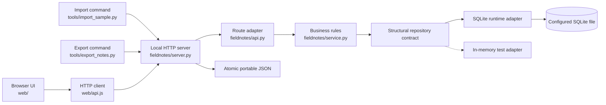
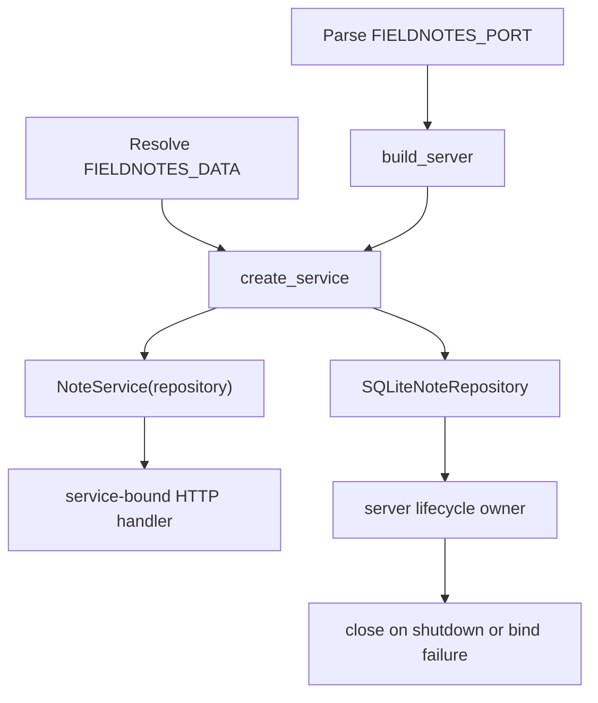
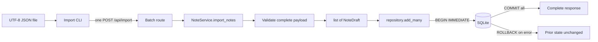

# Architecture

Field Notes is a local browser application with one HTTP authority and one
durable state owner. The browser and import command both reach the same service
through the API. The running service receives a configured SQLite repository;
the in-memory repository is retained for tests.

## System view



The HTTP server serves the browser files and API from one loopback origin.
`web/api.js` uses relative paths for every read and mutation; browser state does
not own note state.

## Layer responsibilities

### Entry points

- `web/index.html` and `web/app.js` render the workspace and interaction states.
- `web/api.js` contains the browser's HTTP calls and response-error translation.
- `tools/import_sample.py` reads one JSON document and submits it to the running
  API without applying a second copy of the domain rules.
- `tools/export_notes.py` reads one document from the running API and publishes
  it through `fieldnotes.exporter` without opening SQLite as another writer.
- `fieldnotes/server.py` is the process entry point and HTTP transport boundary.

### Application boundary

- `fieldnotes/api.py` maps HTTP methods, paths, request JSON, and status codes to
  service operations.
- `fieldnotes/service.py` owns create validation, tag normalization, search, and
  import orchestration.
- `fieldnotes/importer.py` converts a complete portable payload into immutable
  `NoteDraft` values before storage starts.
- `fieldnotes/models.py` defines stored `Note` values and storage-neutral
  `NoteDraft` values.

### Storage and composition

- `fieldnotes/repository.py` provides the in-memory adapter used by unit and
  conformance tests.
- `fieldnotes/sqlite_repository.py` provides the transactional runtime adapter.
- `fieldnotes/composition.py` chooses the configured SQLite path, constructs one
  repository, and injects that exact instance into `NoteService`.
- `fieldnotes/config.py` owns the environment-backed port and data-path defaults.

The repository contract is intentionally structural. The service consumes
`list`, `add`, `add_many`, `delete`, and `clear`; shared conformance tests prove
that memory and SQLite preserve the same observable behavior.

## Runtime composition



Port parsing happens before storage opens. This matters because malformed port
configuration should not create a database as a side effect. If HTTP binding
fails after the repository opens, `build_server()` closes the repository before
returning the failure. Normal shutdown closes both the server and database.

The default configuration is:

```text
FIELDNOTES_PORT=8000
FIELDNOTES_DATA=./data/fieldnotes.sqlite3
```

The server binds only to `127.0.0.1` and serves both the UI and API. A real-server
regression test fetches the page, JavaScript client, and API from that one
process.

## Ordinary request flow

```text
browser request
  -> ThreadingHTTPServer handler
  -> handle_request(method, path, body, service)
  -> NoteService operation
  -> SQLiteNoteRepository transaction or read
  -> public JSON response
```

Create validation and tag cleanup happen in the service before
`repository.add()`. List and search return repository-owned data through copied
domain objects. Delete returns a boolean from storage, which the API translates
to `204` or `404`.

Before dispatching a mutation, the live server verifies any browser `Origin`
against the actual loopback origin. JSON POST routes require the intended media
type, oversized bodies stop before parsing, and unsupported API methods remain
inside the structured JSON error contract.

Unexpected application exceptions cross into the server's generic structured
`500 internal_error` response instead of leaking internal details.

## Atomic import flow



The command parses JSON locally only so file and syntax errors are readable. It
sends the original parsed document to the server, leaving title cleanup, tag
normalization, timestamp policy, and source-ID handling in one place.

The service validates every item before calling storage. SQLite then holds one
Python lock and one database transaction across the complete batch. A failure on
a later insertion rolls back earlier insertions from that request. The operation
is atomic for one request, but not idempotent after an ambiguous lost response.

## Atomic export and recovery flow

```mermaid
flowchart LR
    DB[("Populated SQLite")] --> API["GET /api/export"]
    API --> CLI["Export command"]
    CLI --> Temp["Complete temporary sibling"]
    Temp --> Publish["Atomic link or replace"]
    Publish --> JSON["Portable notes JSON"]
    JSON --> Import["Real import command"]
    Import --> Fresh[("Separate empty SQLite")]
    Fresh --> Restart["New server process"]
    Restart --> Same["Equivalent public fields"]
```



The default path uses an atomic hard link and refuses an existing destination
without a check-then-write race. `--replace` flushes a complete temporary sibling
before `os.replace()`. Failure removes the temporary file and preserves the
previous destination bytes.

Recovery compares ordered titles, bodies, tags, and timestamps. IDs are local
database identities and are excluded from cross-database equality.

## Browser request-state boundary

Every list, search, or post-mutation refresh receives a monotonically increasing
generation. Only the newest generation may render or publish an error. A save
clears a submitted field only if the user has not changed it while the request
was pending. Confirmed mutation success is recorded before refresh, so refresh
failure cannot relabel a committed write as failed.

## Data ownership and schema

SQLite schema version 1 is recorded through `PRAGMA user_version`:

```sql
CREATE TABLE notes (
    id INTEGER PRIMARY KEY AUTOINCREMENT,
    title TEXT NOT NULL,
    body TEXT NOT NULL,
    tags TEXT NOT NULL,
    created_at TEXT NOT NULL
);
```

Tags are stored as JSON text and decoded at the repository boundary. Timestamps
must be timezone-aware UTC strings. Public responses use `createdAt`; Python
objects use `created_at`.

Version zero is not assumed to mean empty. Startup classifies the configured
file before changing it:

- a truly empty database may be initialized;
- a compatible unversioned `notes` table is validated and adopted;
- unrelated or incompatible unversioned databases are rejected unchanged;
- a version-one database missing required schema is rejected unchanged;
- unreadable rows are rejected before an unversioned table is stamped; and
- unknown nonzero schema versions fail visibly.

There is no silent in-memory fallback when configured storage cannot open.

## Concurrency boundary

Both adapters protect mutations with one process-local lock. SQLite mutations
also use `BEGIN IMMEDIATE`, which reserves the database write path at transaction
start. Shared conformance tests race a 40-note batch against one ordinary add and
prove that another write cannot take an ID from the middle of the batch.

This evidence covers concurrent threads sharing the application repository. It
is not a general claim about arbitrary external processes writing directly to
the same database.

## Verification boundaries

The current suite verifies the architecture at several levels:

- unit tests for models, normalization, service, API, and commands;
- shared repository conformance tests for memory and SQLite;
- transaction tests with controlled SQLite trigger failures;
- real server subprocess tests using public HTTP;
- complete stop/restart tests against the same configured database;
- real CLI import followed by API retrieval, restart, rollback, and retry;
- real export and import commands using two database files and a restart;
- live-socket trust-boundary checks that also assert unchanged state;
- deterministic JavaScript request-state tests; and
- a real headless-Chrome workflow at desktop and narrow widths.

The current gate passes 110 Python tests plus 2 JavaScript state tests. The useful
claim is not the number; it is that the tests cross process, persistence,
filesystem-publication, browser event-loop, and failure boundaries.

## Current outer boundary

The agreed local-beta path is connected. Remaining boundaries are deliberately
outside this wave: idempotent retry after an unknown post-commit response,
arbitrary external multi-process writers, and a hosted trust/deployment model.

The pre-repair source snapshot remains in
[`ARCHITECTURE_AS_IS.md`](ARCHITECTURE_AS_IS.md) for comparison, and the exact
broken fixture is retained at Git commit `1884f4d`.
