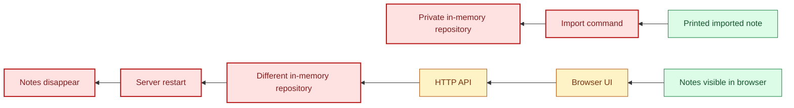
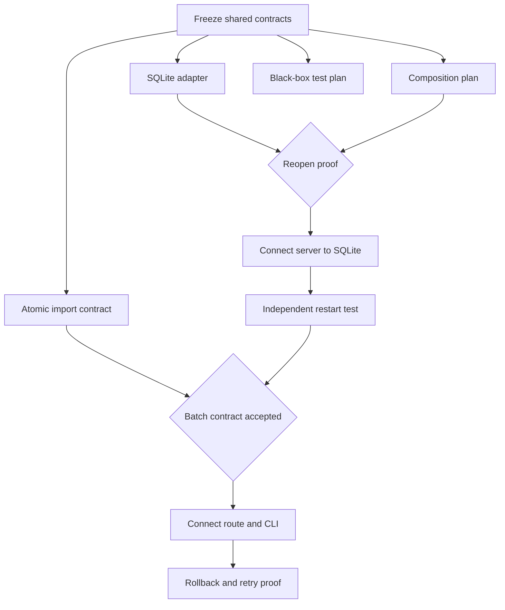

# Bootwitch Doctor: Repair Journey

> **A multi-agent architecture repair experiment**

Bootwitch Doctor is the story of repairing a small application by coordinating
five coding agents in one shared repository. The application is called Field
Notes. It was intentionally messy enough to make the coordination problem real:
some components worked alone, some documentation described code that did not
exist yet, and the paths that appeared successful did not all reach the same
data.

The experiment was less about asking five agents to fix five files and more
about answering a harder question: how do you keep parallel work pointed at one
system when the system itself is still being understood?

## The repair brief

The starting request was deliberately broad: inspect the repository, identify
which code actually worked, and map the architecture before changing it. Once
the first map existed, I chose to work backward from visible outcomes.

That choice shaped the rest of the repair:

1. Trace what the user sees back to the component that owns the state.
2. Mark every broken or missing connection red, even when nearby components
   pass their own tests.
3. Repair the furthest red connection first and redraw the trace.
4. Give each agent a distinct boundary, shared context, and a standard handoff.
5. Require success and failure evidence before treating a connection as fixed.
6. Use one integration lead to reconcile the live tree and prevent competing
   sources of truth.

This kept the work grounded in observable behavior rather than the number of
files changed or tests added.

## Before: several working pieces, no durable path

At the baseline, Field Notes had a browser, a Python API, an in-memory
repository, a JSON importer, and tests. That looked close to a working product.
The backward trace showed a different story.

The confusing part was that the grey and green pieces were not necessarily
wrong. The importer could print a note, and the repository could hold one. The
problem was the connection: the command created a private repository that the
server never used. Likewise, the server could acknowledge a write while keeping
it only for the lifetime of that process.

This led to the central distinction of the project:

- **Component proof** shows that a function or class works in isolation.
- **Connection proof** shows that the real entry point reaches that component
  through the running system.

## Intermediate: parallel repairs behind acceptance gates

Instead of letting every agent edit the full stack, I divided the work by
architectural responsibility.

| Lane | Responsibility | Required evidence |
| --- | --- | --- |
| Agent 1 | Architecture and integration | Updated traces and accepted contracts |
| Agent 2 | Durable SQLite storage | Conformance, rollback, and close/reopen tests |
| Agent 3 | Atomic batch import | Whole-payload validation and zero partial mutation |
| Agent 4 | Runtime composition and CLI wiring | One state owner and one import request |
| Agent 5 | Independent verification | Real HTTP, CLI, failure, and restart proof |

The agents could investigate in parallel, but implementation crossed explicit
gates. A SQLite adapter passing isolated tests did not immediately turn the
runtime connection green. The server still had to select it, own its lifecycle,
and survive a real stop and restart against the same file.

The intermediate stage exposed the value of an integration role. Individually
reasonable changes still produced narrow misses: port validation happened after
opening storage, a broad exception type blurred client errors with server
failures, and batch concurrency needed a permanent regression test. Those were
found by reviewing the connected tree rather than grading each lane alone.

## After: one authority, one transaction, restart proof

The repaired import path now has one state owner and one publication boundary.

```mermaid
flowchart LR
    File["JSON file"] --> CLI["Import command"]
    CLI -->|"one POST /api/import"| HTTP["Running HTTP server"]
    HTTP --> Route["Import route"]
    Route --> Service["NoteService"]
    Service --> Validate["Validate complete payload"]
    Validate --> Batch["repository.add_many"]
    Batch -->|"BEGIN IMMEDIATE"| SQLite[("SQLite")]
    SQLite --> Restart["New server process"]
    Restart --> Visible["Same notes through the API"]
```

The final 89-test suite includes:

- shared behavior tests for the memory and SQLite repositories;
- controlled database failures that prove transaction rollback;
- real server subprocesses communicating over HTTP;
- the real import command rather than a test-only substitute;
- complete process restarts against the configured database;
- corrupt and incompatible database startup failures; and
- a concurrent write test proving a batch keeps contiguous IDs.

The test count is not the main claim. The useful evidence is that the tests
cross the same process, storage, and failure boundaries shown in the diagrams.

## Decisions I made during orchestration

### Work backward from the outcome

Starting with "the note is visible" or "the import succeeded" made it easier to
find where an apparently working path stopped being trustworthy. It also gave
the agents a shared definition of done.

### Fix connections before polishing components

The upper browser path still had cleanup opportunities, but the missing storage
connections were the larger architectural risk. I kept the first wave focused
on durable state and atomic import so cosmetic work did not hide data loss.

### Separate implementation from verification

The agent that wrote a component was not the only source of evidence for it.
The verification lane exercised public commands and process boundaries, while
the integration lead checked that accepted components were actually selected by
the runtime.

### Re-map after every accepted change

The forward trace answered, "Where does this request go?" The backward trace
answered, "What has to be true for this visible result to exist?" Redrawing both
prevented an old architecture diagram from becoming a substitute for the live
code.

### Preserve uncertainty in the records

Early triage notes and diagrams remain in the repository as dated snapshots.
Current documentation labels them as historical instead of rewriting them to
look more certain than they were. That makes the progression inspectable and
keeps the final story tied to source evidence.

## What this demonstrates

Bootwitch Doctor demonstrates practical multi-agent orchestration at repository
scale: decomposition by dependency boundary, shared contracts, parallel work
without duplicate ownership, integration review, and black-box verification.

It also shows the part of orchestration that is easy to miss. The agents did not
replace architectural judgment. They made it more important. Someone still had
to choose the next connection, resolve contradictory evidence, decide what
counted as proof, and keep the whole system legible while it changed.

## Explore the evidence

- [`ARCHITECTURE_AS_IS.md`](ARCHITECTURE_AS_IS.md): source-derived baseline
- [`ARCHITECTURE.md`](ARCHITECTURE.md): repaired system architecture
- [`../agents/shared/ARCHITECTURE_MAPS.md`](../agents/shared/ARCHITECTURE_MAPS.md):
  evolving forward and backward traces
- [`../diagrams/plans/CONNECTION_FIRST_REPAIR_PLAN.md`](../diagrams/plans/CONNECTION_FIRST_REPAIR_PLAN.md):
  original connection-first plan
- [`../agents/README.md`](../agents/README.md): agent roles and coordination rules
- [`TECHNICAL.md`](TECHNICAL.md): implementation readthrough

## Portfolio copy

**Bootwitch Doctor**

*A multi-agent architecture repair experiment*

I coordinated five coding agents to repair a deliberately chaotic local notes
application. We mapped the existing system, traced failures backward from
observable outcomes, divided repairs by architectural boundary, and re-ran the
forward and backward traces after each accepted connection. The final system
replaced disconnected in-memory paths with one SQLite-backed runtime and an
atomic import flow, verified through 89 tests spanning HTTP, CLI, transaction
failure, concurrency, and complete process restarts.
